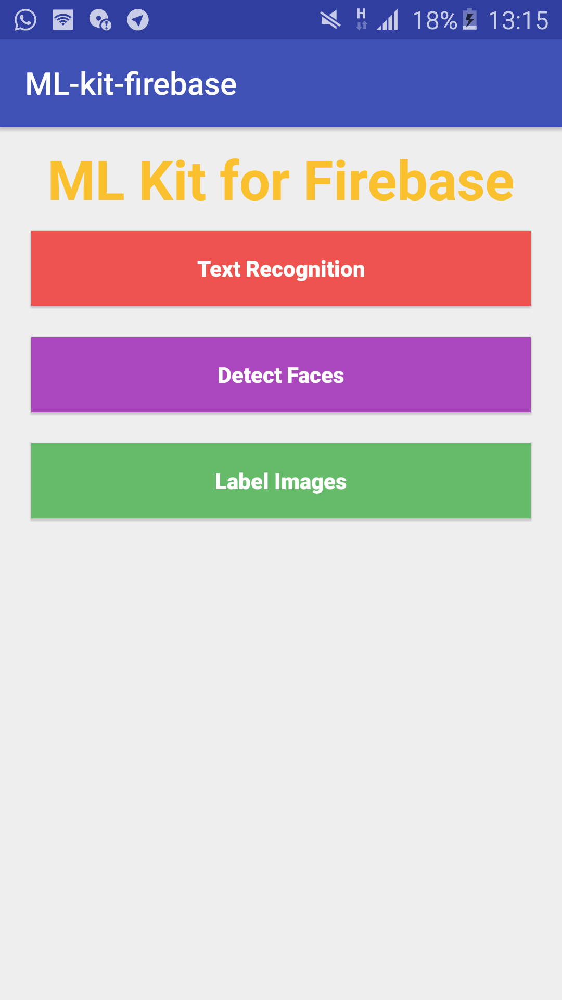
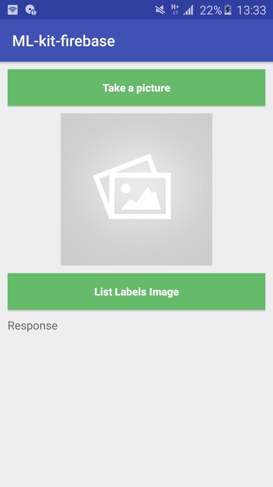

# AndroidMLKitFirebase

The ML Kit for Firebase Android Basic

Introduction
------------

- [Read more about ML Kit for Firebase](https://firebase.google.com/docs/ml-kit/)

Getting Started
---------------

- [Add Firebase to your Android Project](https://firebase.google.com/docs/android/setup).

- Demo Basic:
  - Face detection
  - Text recognition (on-device)
  - Image labeling (on-device)

Result
-----------

  
  

